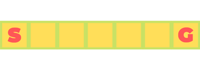

# RLexample

This is a simple example of reinforcement learning. Hope this encourages you
to build something interesting yourself.

Change from iter1.

## Environment



The environment is a 1x7 grid. The agent starts at **S**, with each
episode ending at **G** and the
available actions are **left** or **right**. There are three different
rewards systems used. Each `.py` file implements different
reward.

## Test yourself!

All the available code is in SliderReward[1-3].py files. Each file
contains complete and independant code.

**Note:** *numpy* should be installed.

To run any of the files:
```shell
python3 SliderReward[1-3].py <no-of-episodes>
```
Here `<no-of-episodes>` is the amount of iterations for training
the agent. If no argument is provided, then the default is 50.

**Example**
```shell
$ python3 SliderReward1.py

$ python3 SliderReward1.py 100
```
